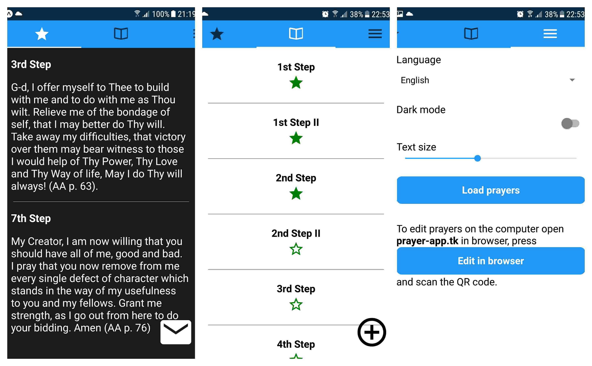

# PrayerApp

**PrayerApp** is react native app for daily prayers

Companion app can be found at [prayer-app.tk](https://prayer-app.tk) 

## Features
- add prayer
- favorite prayer
- open all favorite prayers at once
- add / edit / delete prayer
- load prayer set
- edit prayers on web and sync with phone

## Project Organisation
- infra  - infrastructure (deployment)
- mobile - react-native mobile app
- server - haskell server
- web    - elm web app

## TODO
- cleaner design
- different prayers lists
